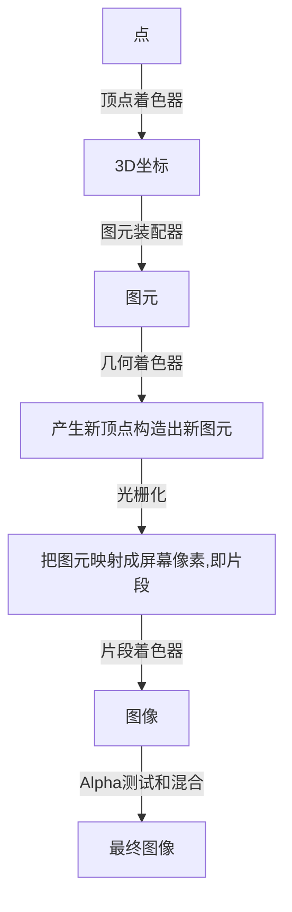

# 笔记



> OpenGL中的一个片段是OpenGL渲染一个像素所需的所有数据。
>
> 片段着色器的主要目的是计算一个像素的最终颜色

## 顶点缓冲对象VBO

一次性发送数据到显卡

```c++
// VBO对象
unsigned int VBO;
// 创建缓冲对象
glGenBuffers(1, &VBO);
// 绑定缓冲对象，绑定到顶点缓冲
glBindBuffer(GL_ARRAY_BUFFER, VBO);
// 复制点到缓冲对象，类型，字节数，指针，绘制类型
glBufferData(GL_ARRAY_BUFFER, sizeof(vertices), vertices, GL_STATIC_DRAW);
```

- GL_STATIC_DRAW ：数据不会或几乎不会改变。
- GL_DYNAMIC_DRAW：数据会被改变很多。
- GL_STREAM_DRAW ：数据每次绘制时都会改变。

缓存位置速度不一样

## 顶点着色器

也就是shader

顶点着色器

```glsl
# 指定OpenGL最低版本
#version 330 core
layout (location = 0) in vec3 aPos;

void main()
{
    gl_Position = vec4(aPos.x, aPos.y, aPos.z, 1.0);
}
```

片段着色器

```glsl
#version 330 core
out vec4 FragColor;

void main()
{
    FragColor = vec4(1.0f, 0.5f, 0.2f, 1.0f);
}
```


### 编译着色器

```c++
const char *vertexShaderSource = "#version 330 core\n"
    "layout (location = 0) in vec3 aPos;\n"
    "void main()\n"
    "{\n"
    "   gl_Position = vec4(aPos.x, aPos.y, aPos.z, 1.0);\n"
    "}\0";
// 创建shader对象
unsigned int vertexShader;
vertexShader = glCreateShader(GL_VERTEX_SHADER);
// 附加到对象并编译，1代表字符串数量
glShaderSource(vertexShader, 1, &vertexShaderSource, NULL);
glCompileShader(vertexShader);

// 判断是否正确编译
int  success;
char infoLog[512];
glGetShaderiv(vertexShader, GL_COMPILE_STATUS, &success);
// 不成功获取错误信息
if(!success)
{
    glGetShaderInfoLog(vertexShader, 512, NULL, infoLog);
    std::cout << "ERROR::SHADER::VERTEX::COMPILATION_FAILED\n" << infoLog << std::endl;
}
```

### 着色器程序

着色器程序对象(Shader Program Object)是多个着色器合并之后并最终链接完成的版本

把上一个着色器的输出给下一个着色器，但是要保证输入输出匹配

```c++
// 创建
unsigned int shaderProgram;
shaderProgram = glCreateProgram();

// 链接
glAttachShader(shaderProgram, vertexShader);
glAttachShader(shaderProgram, fragmentShader);
glLinkProgram(shaderProgram);

// 检测是否链接成功
glGetProgramiv(shaderProgram, GL_LINK_STATUS, &success);
if(!success) {
    glGetProgramInfoLog(shaderProgram, 512, NULL, infoLog);
    ...
}

// 激活，激活后说着色器的调用渲染都会调用这个
glUseProgram(shaderProgram);

// 链接后可以删除着色器对象
glDeleteShader(vertexShader);
glDeleteShader(fragmentShader);


```

## 链接顶点属性

GL_ARRAY_BUFFER的存储是紧密排列的，使用函数解析顶点数据

```c++
glVertexAttribPointer(0, 3, GL_FLOAT, GL_FALSE, 3 * sizeof(float), (void*)0);
// 启用顶点属性
glEnableVertexAttribArray(0);
```

- 第一个参数指定我们要配置的顶点属性。还记得我们在顶点着色器中使用`layout(location = 0)`定义了position顶点属性的位置值(Location)吗？它可以把顶点属性的位置值设置为`0`。因为我们希望把数据传递到这一个顶点属性中，所以这里我们传入`0`。
- 第二个参数指定顶点属性的大小。顶点属性是一个`vec3`，它由3个值组成，所以大小是3。
- 第三个参数指定数据的类型，这里是GL_FLOAT(GLSL中`vec*`都是由浮点数值组成的)。
- 下个参数定义我们是否希望数据被标准化(Normalize)。如果我们设置为GL_TRUE，所有数据都会被映射到0（对于有符号型signed数据是-1）到1之间。我们把它设置为GL_FALSE。
- 第五个参数叫做步长(Stride)，它告诉我们在连续的顶点属性组之间的间隔。由于下个组位置数据在3个`float`之后，我们把步长设置为`3 * sizeof(float)`。要注意的是由于我们知道这个数组是紧密排列的（在两个顶点属性之间没有空隙）我们也可以设置为0来让OpenGL决定具体步长是多少（只有当数值是紧密排列时才可用）。一旦我们有更多的顶点属性，我们就必须更小心地定义每个顶点属性之间的间隔，我们在后面会看到更多的例子（译注: 这个参数的意思简单说就是从这个属性第二次出现的地方到整个数组0位置之间有多少字节）。
- 最后一个参数的类型是`void*`，所以需要我们进行这个奇怪的强制类型转换。它表示位置数据在缓冲中起始位置的偏移量(Offset)。由于位置数据在数组的开头，所以这里是0。我们会在后面详细解释这个参数。

绘制流程

```c++
// 0. 复制顶点数组到缓冲中供OpenGL使用
glBindBuffer(GL_ARRAY_BUFFER, VBO);
glBufferData(GL_ARRAY_BUFFER, sizeof(vertices), vertices, GL_STATIC_DRAW);
// 1. 设置顶点属性指针
glVertexAttribPointer(0, 3, GL_FLOAT, GL_FALSE, 3 * sizeof(float), (void*)0);
glEnableVertexAttribArray(0);
// 2. 当我们渲染一个物体时要使用着色器程序
glUseProgram(shaderProgram);
// 3. 绘制物体
someOpenGLFunctionThatDrawsOurTriangle();
```

### 顶点数组对象

顶点数组对象(Vertex Array Object, VAO)，只需要执行一次，以后每次绘制只需要绑定VAO就行


```c++
// 创建
unsigned int VAO;
glGenVertexArrays(1, &VAO);

// ..:: 初始化代码（只运行一次 (除非你的物体频繁改变)） :: ..
// 1. 绑定VAO
glBindVertexArray(VAO);
// 2. 把顶点数组复制到缓冲中供OpenGL使用
glBindBuffer(GL_ARRAY_BUFFER, VBO);
glBufferData(GL_ARRAY_BUFFER, sizeof(vertices), vertices, GL_STATIC_DRAW);
// 3. 设置顶点属性指针
glVertexAttribPointer(0, 3, GL_FLOAT, GL_FALSE, 3 * sizeof(float), (void*)0);
glEnableVertexAttribArray(0);

[...]

// ..:: 绘制代码（渲染循环中） :: ..
// 4. 绘制物体
glUseProgram(shaderProgram);
glBindVertexArray(VAO);
someOpenGLFunctionThatDrawsOurTriangle();
```

## 索引缓冲对象

索引缓冲对象(Element Buffer Object，EBO，也叫Index Buffer Object，IBO)

用来处理共用点的情况

```c++
float vertices[] = {
    0.5f, 0.5f, 0.0f,   // 右上角
    0.5f, -0.5f, 0.0f,  // 右下角
    -0.5f, -0.5f, 0.0f, // 左下角
    -0.5f, 0.5f, 0.0f   // 左上角
};

unsigned int indices[] = { // 注意索引从0开始! 
    0, 1, 3, // 第一个三角形
    1, 2, 3  // 第二个三角形
};
```

创建EBO

```c++
// 创建
unsigned int EBO;
glGenBuffers(1, &EBO);

// 绑定传输数据
glBindBuffer(GL_ELEMENT_ARRAY_BUFFER, EBO);
glBufferData(GL_ELEMENT_ARRAY_BUFFER, sizeof(indices), indices, GL_STATIC_DRAW);
```

流程

```c++
// ..:: 初始化代码 :: ..
// 1. 绑定顶点数组对象
glBindVertexArray(VAO);
// 2. 把我们的顶点数组复制到一个顶点缓冲中，供OpenGL使用
glBindBuffer(GL_ARRAY_BUFFER, VBO);
glBufferData(GL_ARRAY_BUFFER, sizeof(vertices), vertices, GL_STATIC_DRAW);
// 3. 复制我们的索引数组到一个索引缓冲中，供OpenGL使用
glBindBuffer(GL_ELEMENT_ARRAY_BUFFER, EBO);
glBufferData(GL_ELEMENT_ARRAY_BUFFER, sizeof(indices), indices, GL_STATIC_DRAW);
// 4. 设定顶点属性指针
glVertexAttribPointer(0, 3, GL_FLOAT, GL_FALSE, 3 * sizeof(float), (void*)0);
glEnableVertexAttribArray(0);

[...]

// ..:: 绘制代码（渲染循环中） :: ..
glUseProgram(shaderProgram);
glBindVertexArray(VAO);
glDrawElements(GL_TRIANGLES, 6, GL_UNSIGNED_INT, 0)
glBindVertexArray(0);
```

# 着色器

结构：

```glsl
#version version_number
in type in_variable_name;
in type in_variable_name;

out type out_variable_name;

uniform type uniform_name;

int main()
{
  // 处理输入并进行一些图形操作
  ...
  // 输出处理过的结果到输出变量
  out_variable_name = weird_stuff_we_processed;
}
```

数据类型：int`、`float`、`double`、`uint`和`bool

## 向量

| 类型    | 含义                            |
| ------- | ------------------------------- |
| `vecn`  | 包含`n`个float分量的默认向量    |
| `bvecn` | 包含`n`个bool分量的向量         |
| `ivecn` | 包含`n`个int分量的向量          |
| `uvecn` | 包含`n`个unsigned int分量的向量 |
| `dvecn` | 包含`n`个double分量的向量       |

向量的重组：

```glsl
vec2 someVec;
vec4 differentVec = someVec.xyxx;
vec3 anotherVec = differentVec.zyw;
vec4 otherVec = someVec.xxxx + anotherVec.yxzy;
```

## 输入输出

`in` `out`关键字

顶点着色器的输入比较特殊，从顶点数据直接接收输入。使用`location`指定输入变量的，`layout (location = 0)`

片段着色器的输出是vec4颜色，需要一个像素颜色，没用则默认为黑色或白色

## Uniform

GPU和CPU变量交互的变量

```c++
angleLocation = glGetUniformLocation(shaderProgram, "ourAngle");
double t = glfwGetTime() / 10;
double angle = t - int(t);
glUniform1f(angleLocation, (float) angle);
```

另外输入多个变量是VAO的设置

输入为：

```c++
// 顶点，颜色
float vertices[] = {
    -0.5f, -0.5f, 0.0f, 1.0f, 0, 0,
    0.5f, -0.5f, 0.0f, 0, 1.0f, 0,
    0.0f, 0.5f, 0.0f, 0, 0, 1.0f,
};
```

顶点shader：

```glsl
#version 330 core
layout (location = 0) in vec3 aPos;
in vec3 aColor;
out vec4 textureColor;

void main()
{
    gl_Position = vec4(aPos.x, aPos.y, aPos.z, 1.0);
    textureColor = vec4(aColor, 1.0);
}
```

设置VAO：

```c++
// 输入变量索引号，0为aPos，1为aColor
glVertexAttribPointer(0, 3, GL_FLOAT, GL_FALSE, 6 * sizeof(float), nullptr);
glVertexAttribPointer(1, 3, GL_FLOAT, GL_FALSE, 6 * sizeof(float), (void *) (3 * sizeof(float)));
glEnableVertexAttribArray(0);
glEnableVertexAttribArray(1);
```

# 纹理

纹理(texture1)

纹理坐标范围为x：0到1，y：0到1，做下角为原点，纹理坐标获取颜色成为**采样**。

需要指定每个顶点对应的纹理坐标，其他点的坐标通过插值得到，比如


纹理环绕方式：

| 环绕方式           | 描述                                                         |
| ------------------ | ------------------------------------------------------------ |
| GL_REPEAT          | 对纹理的默认行为。重复纹理图像。                             |
| GL_MIRRORED_REPEAT | 和GL_REPEAT一样，但每次重复图片是镜像放置的。                |
| GL_CLAMP_TO_EDGE   | 纹理坐标会被约束在0到1之间，超出的部分会重复纹理坐标的边缘，产生一种边缘被拉伸的效果。 |
| GL_CLAMP_TO_BORDER | 超出的坐标为用户指定的边缘颜色。                             |


使用`glTexParameter`函数设置

```c++
glTexParameteri(GL_TEXTURE_2D, GL_TEXTURE_WRAP_S, GL_MIRRORED_REPEAT);
glTexParameteri(GL_TEXTURE_2D, GL_TEXTURE_WRAP_T, GL_MIRRORED_REPEAT);
```

如果使用最后一个，还需要设置边框颜色

```c++
float borderColor[] = { 1.0f, 1.0f, 0.0f, 1.0f };
glTexParameterfv(GL_TEXTURE_2D, GL_TEXTURE_BORDER_COLOR, borderColor);
```

> 无缝贴图：重复后图片和图片之间没有明显的边线

## 纹理过滤

纹理小物体大拉伸时的插值选项

GL_LINEAR，线性过滤，计算均值，看上去物体会变得模糊

GL_NEAREST，最近的值，会产生像素风格图像

设置方式

```c++
glTexParameteri(GL_TEXTURE_2D, GL_TEXTURE_MIN_FILTER, GL_NEAREST);
glTexParameteri(GL_TEXTURE_2D, GL_TEXTURE_MAG_FILTER, GL_LINEAR);
```

## 多级渐远纹理

由于抽样带来性能问题，对与不同距离的物体渲染采用不同大小的贴图


使用OpenGL函数`glGenerateMipmaps`可以创建

## stb_image

单头文件图像加载库

```bash
vcpkg install stb
```

```c++
// 定义了该宏后只会包含相关的函数
#define STB_IMAGE_IMPLEMENTATION
#include "stb_image.h"

int width, height, nrChannels;
unsigned char *data = stbi_load("container.jpg", &width, &height, &nrChannels, 0);
```

## 生成纹理

```c++
// 创建纹理
GLuint texture1;
glGenTextures(1, &texture1);

// 绑定纹理
glBindTexture(GL_TEXTURE_2D, texture1);

// 载入图片
glTexImage2D(GL_TEXTURE_2D, 0, GL_RGB, width, height, 0, GL_RGB, GL_UNSIGED_BYTE, data);
glGenerateMipmap(GL_TEXTURE_2D);
```

- 第一个参数指定了纹理目标(Target)。设置为GL_TEXTURE_2D意味着会生成与当前绑定的纹理对象在同一个目标上的纹理（任何绑定到GL_TEXTURE_1D和GL_TEXTURE_3D的纹理不会受到影响）。
- 第二个参数为纹理指定多级渐远纹理的级别，如果你希望单独手动设置每个多级渐远纹理的级别的话。这里我们填0，也就是基本级别。
- 第三个参数告诉OpenGL我们希望把纹理储存为何种格式。我们的图像只有`RGB`值，因此我们也把纹理储存为`RGB`值。
- 第四个和第五个参数设置最终的纹理的宽度和高度。我们之前加载图像的时候储存了它们，所以我们使用对应的变量。
- 下个参数应该总是被设为`0`（历史遗留的问题）。
- 第七第八个参数定义了源图的格式和数据类型。我们使用RGB值加载这个图像，并把它们储存为`char`(byte)数组，我们将会传入对应值。
- 最后一个参数是真正的图像数据。

## 纹理单元

使用纹理单元可以在shader里面对多个纹理进行叠加运算处理

```c++
glActiveTexture(GL_TEXTURE0);
glBindTexture(GL_TEXTURE_2D, texture1);
glActiveTexture(GL_TEXTURE1);
glBindTexture(GL_TEXTURE_2D, texture2);
```

```glsl
#version 330 core
...

uniform sampler2D texture2;
uniform sampler2D texture2;

void main()
{
    FragColor = mix(texture1(texture2, TexCoord), texture1(texture2, TexCoord), 0.2);
}
```

# 变换

## 向量

## GLM

可以通过平移量和旋转量来构建平移旋转变换矩阵

```c++
glm::vec4 vec(1.0f, 0.0f, 0.0f, 1.0f);
// 平移变换
glm::mat4 trans;
trans = glm::translate(trans, glm::vec3(1.0f, 1.0f, 0.0f));

// 旋转
trans = glm::rotate(trans, glm::radians(90.0f), glm::vec3(0.0, 0.0, 1.0));

// 缩放
trans = glm::scale(trans, glm::vec3(0.5, 0.5, 0.5));

vec = trans * vec;
```

# 坐标系统

- 局部空间(Local Space，或者称为物体空间(Object Space))
- 世界空间(World Space)
- 观察空间(View Space，或者称为视觉空间(Eye Space))
- 裁剪空间(Clip Space)
- 屏幕空间(Screen Space)


1. 局部坐标是对象相对于局部原点的坐标，也是物体起始的坐标。
2. 下一步是将局部坐标变换为世界空间坐标，世界空间坐标是处于一个更大的空间范围的。这些坐标相对于世界的全局原点，它们会和其它物体一起相对于世界的原点进行摆放。
3. 接下来我们将世界坐标变换为观察空间坐标，使得每个坐标都是从摄像机或者说观察者的角度进行观察的。
4. 坐标到达观察空间之后，我们需要将其投影到裁剪坐标。裁剪坐标会被处理至-1.0到1.0的范围内，并判断哪些顶点将会出现在屏幕上。
5. 最后，我们将裁剪坐标变换为屏幕坐标，我们将使用一个叫做视口变换(Viewport Transform)的过程。视口变换将位于-1.0到1.0范围的坐标变换到由glViewport函数所定义的坐标范围内。最后变换出来的坐标将会送到光栅器，将其转化为片段。

## 局部空间

对于模型来说的基准坐标系

## 世界空间

所有模型统一的坐标空间

## 观察空间

摄像机坐标空间

## 裁剪空间

投影后裁剪掉视角之外的点

### 正射投影

平行线仍然是平行线

```c++
glm::ortho(0.0f, 800.0f, 0.0f, 600.0f, 0.1f, 100.0f);
```

### 透视投影

远小近大

```c++
glm::mat4 proj = glm::perspective(glm::radians(45.0f), (float)width/(float)height, 0.1f, 100.0f);
```


第一个参数决定了角度，第二个参数设置高宽比，第三个近距离平面，第四个参数远距离平面

使用矩阵乘法变换坐标系

```glsl
#version 330 core
layout (location = 0) in vec3 aPos;
layout (location = 1) in vec2 aTexCoord;
out vec2 TexCoord;

uniform mat4 transform;
uniform mat4 model;
uniform mat4 view;
uniform mat4 projection;

void main()
{
    gl_Position = projection * view * model * transform * vec4(aPos.x, aPos.y, aPos.z, 1.0);
    TexCoord = aTexCoord;
}
```

矩阵乘法从右到左

# 摄像机

## 摄像机位置

## 摄像机方向

从被观测点到相机的向量，并不是朝向的方向

## 右轴

摄像机空间的x轴正方向，获取方式是通过借助一个向上的向量和方向向量叉乘得到和方向向量垂直的右向量

## 上轴

右向量和方向向量叉乘

## Look At

观察矩阵，通过lookAt函数创建，第一个是相机竖直方向，第二个是目标位置，第三个是相机位置

```c++
glm::mat4 view;
view = glm::lookAt(glm::vec3(0.0f, 0.0f, 3.0f), 
           glm::vec3(0.0f, 0.0f, 0.0f), 
           glm::vec3(0.0f, 1.0f, 0.0f));
```

z轴方向始终是垂直于视角的向上的，所以固定不变

根据相机方向角计算方向向量（相机不绕着z轴转动，不然要更改lookAt的z轴）

```c++
glm::vec3 front;
front.x = cos(glm::radians(yaw)) * cos(glm::radians(pitch));
front.y = sin(glm::radians(pitch));
front.z = sin(glm::radians(yaw)) * cos(glm::radians(pitch));
```

# 词汇

- **OpenGL**： 一个定义了函数布局和输出的图形API的正式规范。
- **GLAD**： 一个拓展加载库，用来为我们加载并设定所有OpenGL函数指针，从而让我们能够使用所有（现代）OpenGL函数。
- **视口(Viewport)**： 我们需要渲染的窗口。
- **图形管线(Graphics Pipeline)**： 一个顶点在呈现为像素之前经过的全部过程。
- **着色器(Shader)**： 一个运行在显卡上的小型程序。很多阶段的图形管道都可以使用自定义的着色器来代替原有的功能。
- **标准化设备坐标(Normalized Device Coordinates, NDC)**： 顶点在通过在剪裁坐标系中剪裁与透视除法后最终呈现在的坐标系。所有位置在NDC下-1.0到1.0的顶点将不会被丢弃并且可见。
- **顶点缓冲对象(Vertex Buffer Object)**： 一个调用显存并存储所有顶点数据供显卡使用的缓冲对象。
- **顶点数组对象(Vertex Array Object)**： 存储缓冲区和顶点属性状态。
- **索引缓冲对象(Element Buffer Object)**： 一个存储索引供索引化绘制使用的缓冲对象。
- **Uniform**： 一个特殊类型的GLSL变量。它是全局的（在一个着色器程序中每一个着色器都能够访问uniform变量），并且只需要被设定一次。
- **纹理(Texture)**： 一种包裹着物体的特殊类型图像，给物体精细的视觉效果。
- **纹理缠绕(Texture Wrapping)**： 定义了一种当纹理顶点超出范围(0, 1)时指定OpenGL如何采样纹理的模式。
- **纹理过滤(Texture Filtering)**： 定义了一种当有多种纹素选择时指定OpenGL如何采样纹理的模式。这通常在纹理被放大情况下发生。
- **多级渐远纹理(Mipmaps)**： 被存储的材质的一些缩小版本，根据距观察者的距离会使用材质的合适大小。
- **stb_image.h**： 图像加载库。
- **纹理单元(Texture Units)**： 通过绑定纹理到不同纹理单元从而允许多个纹理在同一对象上渲染。
- **向量(Vector)**： 一个定义了在空间中方向和/或位置的数学实体。
- **矩阵(Matrix)**： 一个矩形阵列的数学表达式。
- **GLM**： 一个为OpenGL打造的数学库。
- **局部空间(Local Space)**： 一个物体的初始空间。所有的坐标都是相对于物体的原点的。
- **世界空间(World Space)**： 所有的坐标都相对于全局原点。
- **观察空间(View Space)**： 所有的坐标都是从摄像机的视角观察的。
- **裁剪空间(Clip Space)**： 所有的坐标都是从摄像机视角观察的，但是该空间应用了投影。这个空间应该是一个顶点坐标最终的空间，作为顶点着色器的输出。OpenGL负责处理剩下的事情（裁剪/透视除法）。
- **屏幕空间(Screen Space)**： 所有的坐标都由屏幕视角来观察。坐标的范围是从0到屏幕的宽/高。
- **LookAt矩阵**： 一种特殊类型的观察矩阵，它创建了一个坐标系，其中所有坐标都根据从一个位置正在观察目标的用户旋转或者平移。
- **欧拉角(Euler Angles)**： 被定义为偏航角(Yaw)，俯仰角(Pitch)，和滚转角(Roll)从而允许我们通过这三个值构造任何3D方向。

# 颜色

看到的物体是反射回来的颜色，没被吸收的颜色

光学模型：

```c++
glm::vec3 lightColor(1.0f, 1.0f, 1.0f);
glm::vec3 objectColor(1.0f, 0.5f, 0.31f);
glm::vec3 result = lightColor * objectColor; // = (1.0f, 0.5f, 0.31f);
```

# 基础光照

冯氏光照模型(Phong Lighting Model)：

- 环境(Ambient)：整体的光亮
- 漫反射(Diffuse)：正对着量，背对着暗，一个平面的亮度是一样的，模拟平行光源
- 镜面(Specular)：高光，模拟点光源

## 环境光照

```glsl
void main()
{
    float ambientStrength = 0.1;
    vec3 ambient = ambientStrength * lightColor;

    vec3 result = ambient * objectColor;
    FragColor = vec4(result, 1.0);
}
```

## 漫反射光照

平行光照射到表面，入射角不一样单位面积的光照强度不一样，需要表面法向量进行计算

## 法线变换

当物体随着空间坐标平移时，法向量不变，但是物体旋转法向量会变化，物体不等比缩放也会


法线矩阵：[文章](http://www.lighthouse3d.com/tutorials/glsl-tutorial/the-normal-matrix/)

```glsl
Normal = mat3(transpose(inverse(model))) * aNormal;
```

> 即使是对于着色器来说，逆矩阵也是一个开销比较大的运算，因此，只要可能就应该避免在着色器中进行逆矩阵运算，它们必须为你场景中的每个顶点都进行这样的处理。用作学习目这样做是可以的，但是对于一个对效率有要求的应用来说，在绘制之前你最好用CPU计算出法线矩阵，然后通过uniform把值传递给着色器（像模型矩阵一样）。

## 镜面光照


夹角越小亮度越高

先计算点到相机的向量，然后根据光源到点的向量利用`reflect`函数根据面法向量计算反射光向量，然后取内积

```glsl
vec3 norm = normalize(Normal);
vec3 lightDir = normalize(lightPos - FragPos);
float diff = max(dot(norm, lightDir), 0.0);

vec3 viewDir = normalize(viewPos - FragPos);
// caculate reflection vector by reflect
vec3 reflectDir = reflect(-lightDir, norm);
float spec = pow(max(dot(viewDir, reflectDir), 0.0), 32);
float specular = specularStrength * spec;
FragColor = vec4((ambientStrength + diff + specular) * lightColor * objectColor, transparent);
```

> 在顶点着色器中实现的冯氏光照模型叫做Gouraud着色(Gouraud Shading)，而不是冯氏着色(Phong Shading)。记住，由于插值，这种光照看起来有点逊色。冯氏着色能产生更平滑的光照效果。

# 材质

```glsl
struct Material {
    vec3 ambient;
    vec3 diffuse;
    vec3 specular;
    float shininess;
}; 
    
struct Light {
    vec3 position;
    vec3 ambient;
    vec3 diffuse;
    vec3 specular;
};
```

材质的反射系数包含三种颜色，用vector

# 光照贴图

漫反射贴图和镜面贴图

环境光和漫反射

放射光贴图
