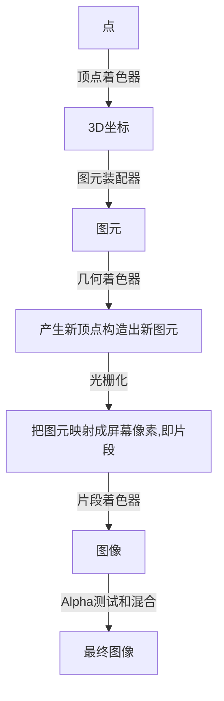

# 笔记



> OpenGL中的一个片段是OpenGL渲染一个像素所需的所有数据。
>
> 片段着色器的主要目的是计算一个像素的最终颜色

## 顶点缓冲对象VBO

一次性发送数据到显卡

```c++
// VBO对象
unsigned int VBO;
// 创建缓冲对象
glGenBuffers(1, &VBO);
// 绑定缓冲对象，绑定到顶点缓冲
glBindBuffer(GL_ARRAY_BUFFER, VBO);
// 复制点到缓冲对象，类型，字节数，指针，绘制类型
glBufferData(GL_ARRAY_BUFFER, sizeof(vertices), vertices, GL_STATIC_DRAW);
```

- GL_STATIC_DRAW ：数据不会或几乎不会改变。
- GL_DYNAMIC_DRAW：数据会被改变很多。
- GL_STREAM_DRAW ：数据每次绘制时都会改变。

缓存位置速度不一样

## 顶点着色器

也就是shader

```glsl
# 指定OpenGL最低版本
#version 330 core
layout (location = 0) in vec3 aPos;

void main()
{
    gl_Position = vec4(aPos.x, aPos.y, aPos.z, 1.0);
}
```

